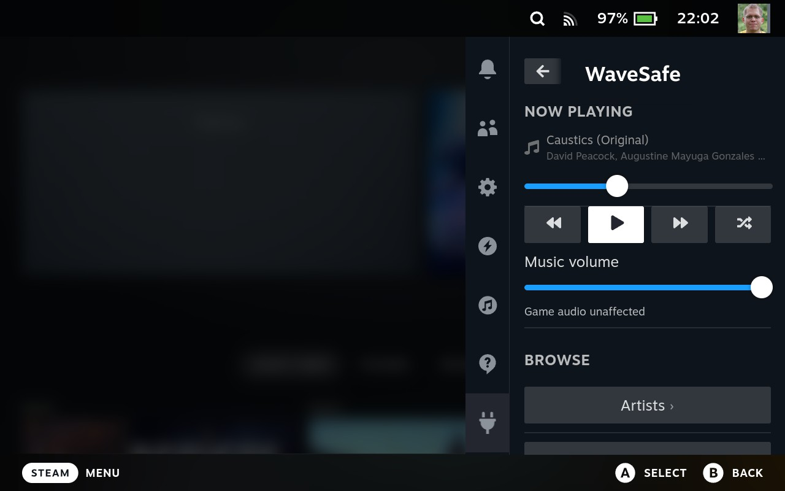
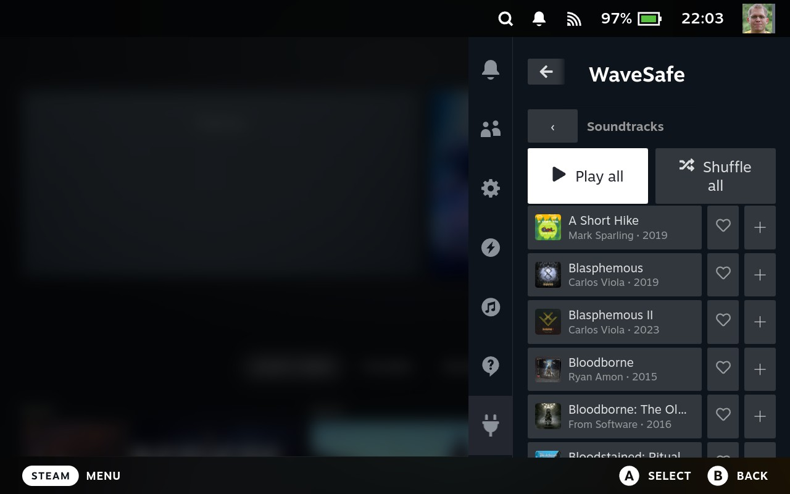
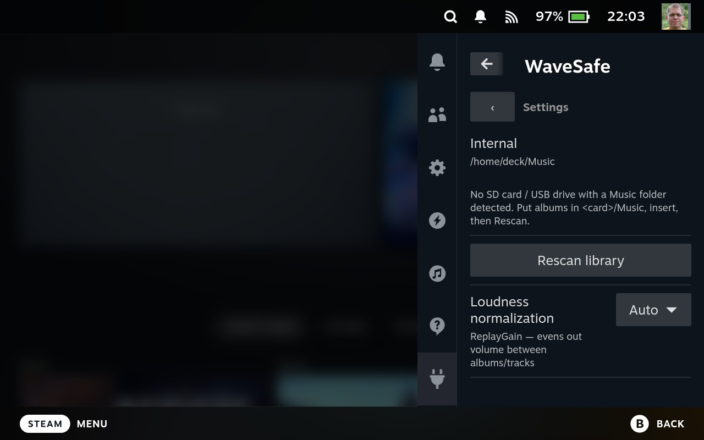

# WaveSafe for Steam Deck

**Your music, playing in the background while you game — fully controllable from
the Steam Quick Access Menu, without ever leaving your game.**

WaveSafe is a **100% offline** local-library music player for the Steam Deck.
No streaming, no accounts, no cloud, no telemetry — and no desktop app to
alt-tab to. Put your own music on the Deck (or an SD card), and play it: gapless,
loudness-normalized, right from the QAM over any running game.

Built on a simple philosophy: a clean local library, done right.

## Screenshots

Everything lives in the Steam Quick Access Menu — over a running game, no app
switching.

| Now Playing + Browse | Library (album art + hearts) | Settings |
|---|---|---|
|  |  |  |

## Features

- 🎮 **Background music over any game** — full transport (play/pause, skip, seek)
  from the Quick Access Menu. No app switching, no leaving your game.
- 📴 **Completely offline** — your files only. No streaming, no sign-in, no
  network, no tracking. Ever.
- 🎚️ **Gapless playback + ReplayGain** — albums flow track-to-track with no gaps,
  and loudness normalization keeps volume even across your whole library.
- 📚 **Drill-down library** — browse by **Artists**, **Soundtracks**, or
  **Favorites**, each row with an album-art thumbnail.
- ❤️ **Favorites at a tap** — heart any album right from the list.
- ▶️ **Play all / Shuffle all** — start a whole artist, all your soundtracks, or
  the entire library as one session.
- 🔊 **Music-vs-game volume** — a dedicated music slider balances against game
  audio without touching the system volume.
- 💾 **Picks up where you left off** — your queue and position survive sleep
  *and* a full power cycle.
- 🗂️ **Read-only library** — WaveSafe never moves, copies, or modifies your
  files. Your music stays exactly where you put it.
- 🪶 **Featherweight** — event-driven with zero polling while you play, built to
  respect the in-game battery budget.

## Install

You'll need [**Decky Loader**](https://decky.xyz) installed first (desktop mode →
browser → decky.xyz → run the installer, then reboot to game mode; you'll see
the 🔌 tab in the QAM).

1. In the QAM, open 🔌 → ⚙ (settings) → **Developer** and enable **Developer
   mode** (lets you install plugins from a zip).
2. Grab **`WaveSafe.zip`** from a [Release](../../releases) (or build it — see
   *Develop* below).
3. In the Decky developer panel, choose **Install plugin from zip** and pick
   `WaveSafe.zip`.
4. Open the QAM (the **…** button) → **WaveSafe**. A music daemon is bundled
   inside — nothing else to install.

## Adding music

WaveSafe plays files from two fixed, **read-only** locations — it never writes to
them:

- **Internal:** `/home/deck/Music`
- **SD card / USB:** a `Music/` folder on any mounted drive

Load albums onto the Deck or a card from your PC, then in the QAM go to
**WaveSafe → Browse → Settings → Rescan library** (a live "Scanning… N tracks"
counter shows progress). Remove a card and its albums drop off on the next
rescan; pop it back in and they return — favorites are remembered either way.

> **Tip:** NTFS-formatted drives don't automount on SteamOS. Use exFAT or ext4
> (the Deck's default SD format is fine).

## Supported formats

The bundled MPD decodes:

- **FLAC** — `.flac`
- **MP3** — `.mp3`
- **Ogg Vorbis** — `.ogg`
- **Opus** — `.opus`
- **AAC** — `.m4a`, `.aac`
- **WAV / AIFF** — `.wav`, `.aiff`

Apple Lossless (**ALAC**) isn't supported yet.

## Develop

A Python backend (`main.py`, module-level state) drives a bundled, committed
static-musl **mpd** daemon (`bin/mpd`) whose audio goes through MPD's `pipe`
output into the host's `pw-cat`. The [@decky/ui](https://github.com/SteamDeckHomebrew/decky-frontend-lib)
frontend (`src/index.tsx`) is event-driven via MPD `idle` — zero polling while
playing. Shared genre/Soundtrack + model logic is vendored in `src/core/`.

```bash
pnpm install
pnpm run build      # rollup → dist/index.js
pnpm run test:ts    # genre logic (node --test)
pnpm run test:py    # backend unit tests vs a fake MPD server (37 tests)
pnpm run test:func  # functional tests vs a REAL mpd daemon (brew install mpd flac, 11 tests)

./scripts/package-plugin.sh   # → out/WaveSafe.zip (~2.7 MB)
```

The static mpd binary at `bin/mpd` is committed (provenance:
[`scripts/build-mpd-static.sh`](scripts/build-mpd-static.sh)); CI builds the
frontend, runs the suites, and publishes a GitHub Release on `v*` tags. The
bundled mpd is GPL-2.0 — see [`THIRD-PARTY-NOTICES.md`](THIRD-PARTY-NOTICES.md);
WaveSafe's own code is [MIT](LICENSE).
